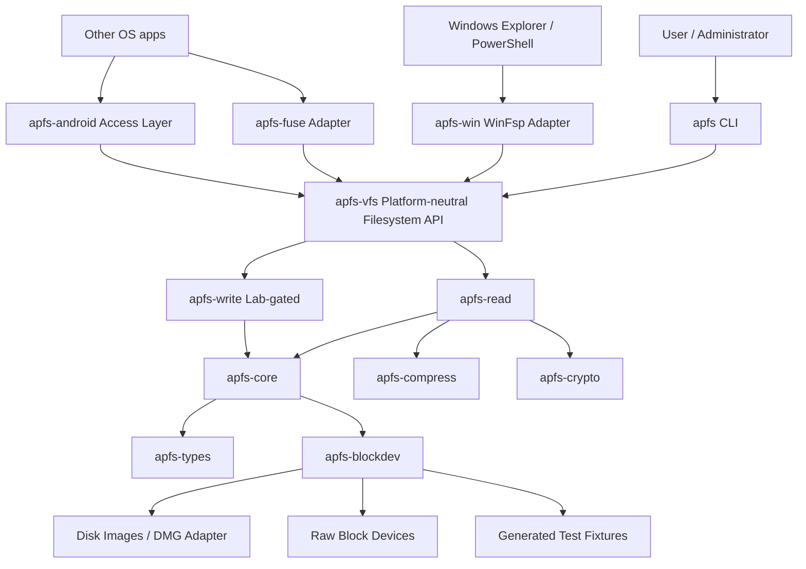
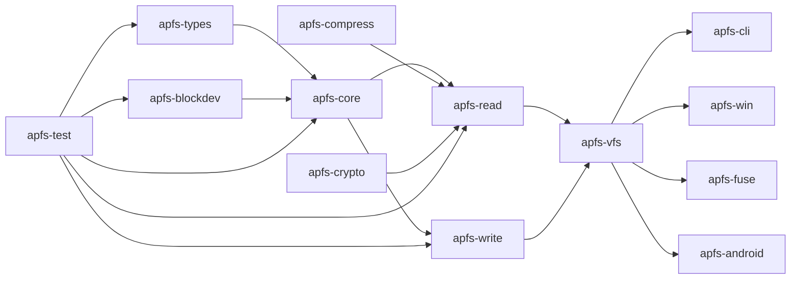
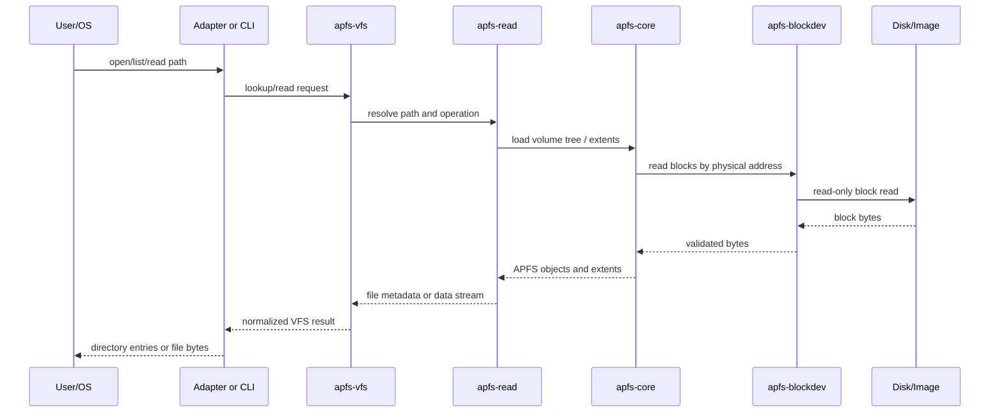
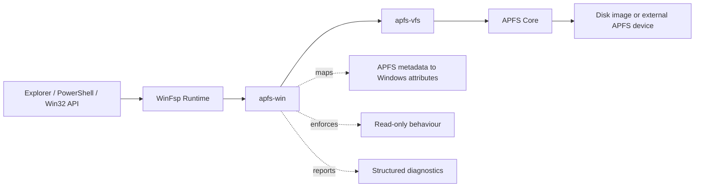
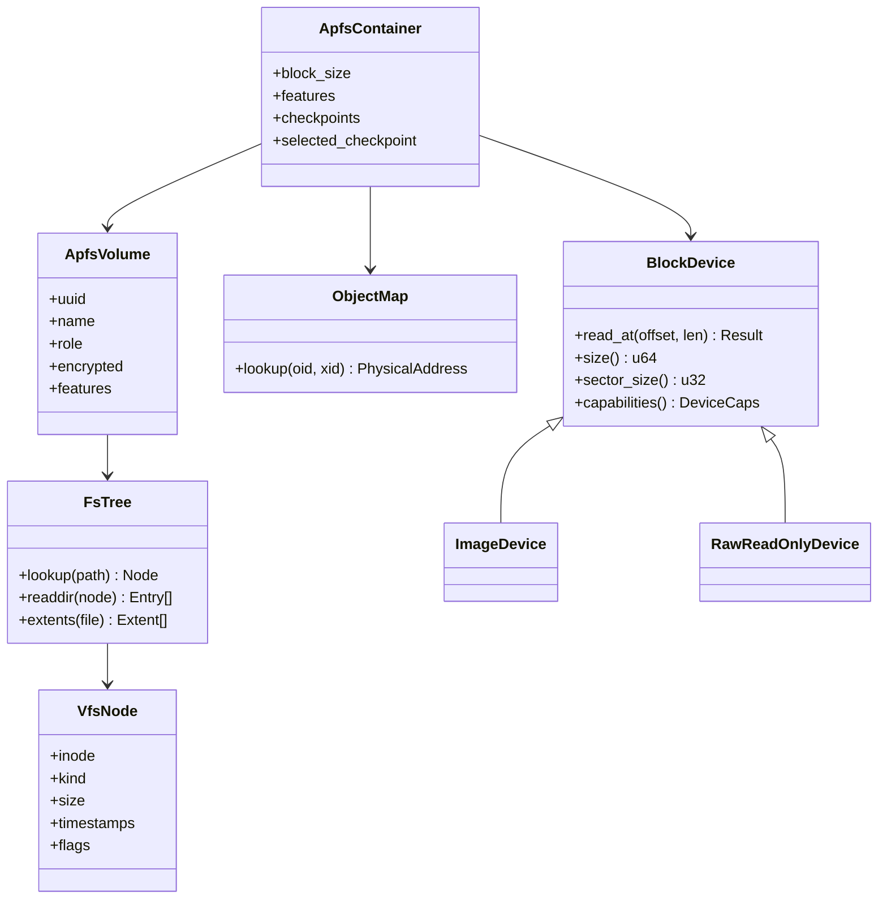
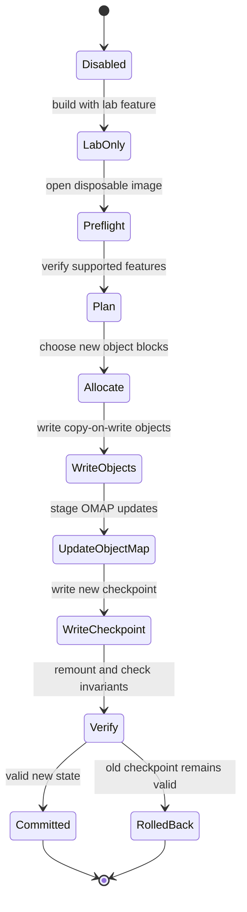
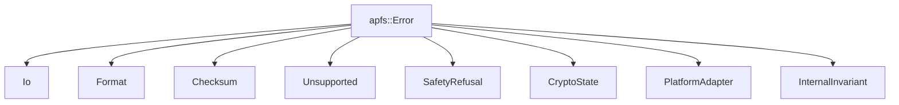
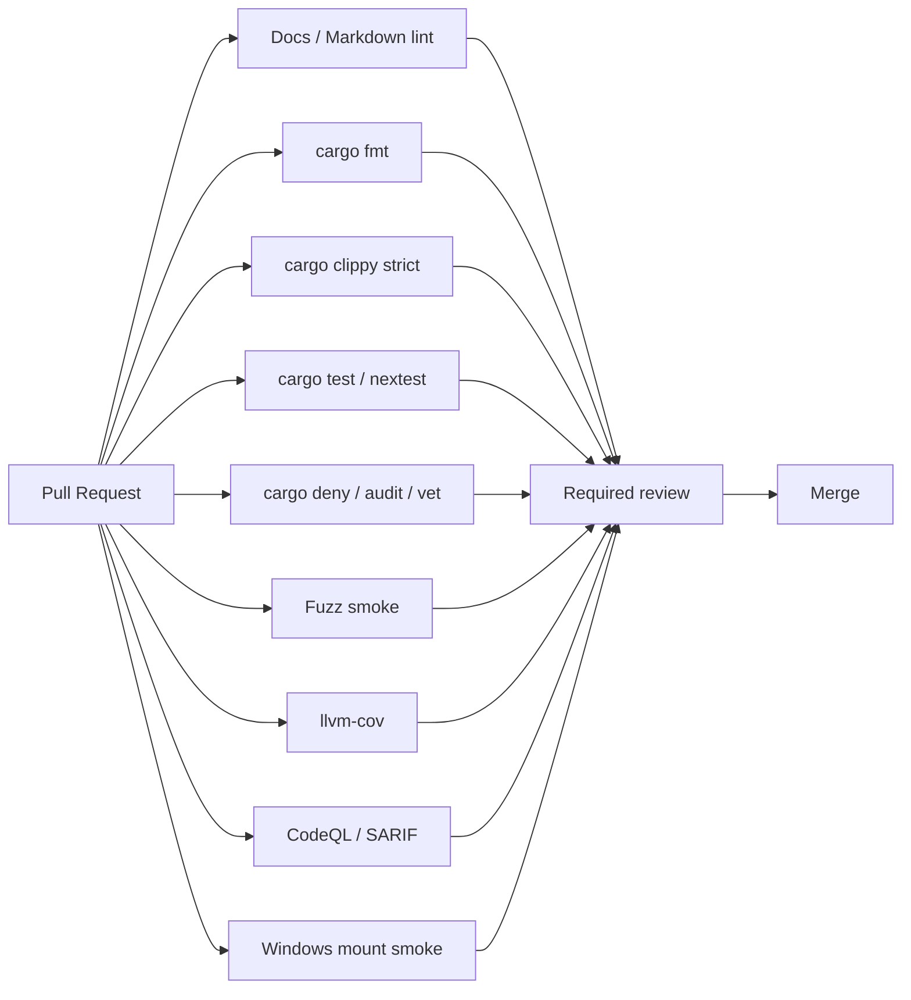

# APFS-RS Design and Architecture

Document version: 0.1.0  
Status: Draft  
Date: 2026-06-23  
Codev phase: Specify/Plan resource

## Design goals

1. **Clean-room Rust core** — all APFS logic lives in shared, platform-neutral crates.
2. **Windows-first delivery** — ship read-only inspection, extraction, and mount before cross-platform expansion.
3. **User-mode filesystem adapters** — avoid custom kernel filesystem drivers unless a later governance decision proves they are necessary.
4. **Read-only by default** — write support is gated behind image-only lab validation first.
5. **Safety as architecture** — unsupported states are explicit typed errors, not best-effort fallthroughs.
6. **CI/CD-first engineering** — every crate, feature, and platform adapter must be testable in GitHub automation.
7. **Codev traceability** — every capability follows issue → spec → plan → PR → review.

## High-level system context



## Rust workspace target

```text
crates/
├── apfs-types       # endian-safe APFS structs, object IDs, feature flags, checksums
├── apfs-blockdev    # block-device abstraction over images, partitions, raw devices, fixtures
├── apfs-core        # container, checkpoints, object map, B-trees, spaceman read model
├── apfs-read        # directory traversal, file extents, metadata, snapshots, xattrs
├── apfs-compress    # ZLIB, LZVN, LZFSE, and compression dispatch
├── apfs-crypto      # software-encryption read support, key handling, zeroisation
├── apfs-write       # copy-on-write transaction builder; disabled outside lab initially
├── apfs-vfs         # platform-neutral filesystem operations
├── apfs-win         # Windows WinFsp adapter; Dokany optional later
├── apfs-fuse        # Linux/macOS/ChromeOS FUSE-compatible adapter
├── apfs-android     # Android library/app integration layer
├── apfs-cli         # inspect, volumes, ls, cat, extract, mount, verify-read, dump-tree
└── apfs-test        # fixture generation, manifests, differential verifier, crash testing
```

## Crate dependency direction



Dependency rule: arrows point toward crates that may depend on the source. Platform crates must not be dependencies of core crates.

## Read-only data path



Read-path invariants:

- All block reads are bounds-checked.
- Metadata checksums and object headers are validated where applicable.
- Tree traversal has depth, cycle, and range guards.
- Unsupported compression/encryption returns a typed unsupported error.
- Extraction never writes outside the destination directory.
- Windows mount mode exposes read-only semantics regardless of source permissions.

## Windows mount architecture



Windows design rules:

- Prefer WinFsp as the first bridge because it supports user-mode Windows filesystems and avoids writing a custom kernel filesystem driver.
- Keep Dokany as a possible secondary adapter, not a first dependency.
- Treat Windows path normalisation and case handling as a dedicated design area.
- Return conservative file attributes and avoid claiming unsupported ACL semantics.
- Mount read-only until the write lab and beta gates are passed.

## Object model



## Write transaction model

Write support must not be a direct mutation API. It should be a staged transaction plan that can be inspected, tested, and interrupted.



Write invariants:

- Never overwrite live metadata in place.
- A crash must leave either the old checkpoint or the new checkpoint valid.
- Every write sub-step must be failure-injectable in tests.
- Physical-device write mode requires a later beta gate, exclusive lock, and preflight verifier.

## Error taxonomy



Typed error principles:

- Corrupt input is not an internal bug.
- Unsupported APFS features are not a panic.
- Internal invariant errors are bugs and should include safe diagnostic context.
- Security-sensitive context must be redacted.

## CI/CD architecture



## GitHub automation design

Minimum workflows for the implementation repo:

| Workflow | Trigger | Purpose |
|---|---|---|
| `ci.yml` | PR, push | Format, clippy, tests, docs, MSRV. |
| `platform.yml` | PR, push | Windows/Linux/macOS matrix build; Windows read-only mount smoke where possible. |
| `security.yml` | PR, schedule | audit, deny, vet, CodeQL/SARIF, secret scan expectations. |
| `fuzz.yml` | schedule, manual | Long-running fuzz jobs and corpus minimisation artifacts. |
| `fixtures.yml` | manual, protected | Generate fixture manifests on controlled macOS runner. |
| `release.yml` | tag | Build signed binaries, checksums, SBOM, provenance attestations. |
| `docs.yml` | PR, push | Render docs, Mermaid diagrams, mdbook if adopted. |

## Development approach

### Vertical slices

Implement capability slices that go end-to-end through CLI and tests instead of building all parsers first.

Example first slices:

1. Identify APFS image and print container metadata.
2. Select checkpoint and print object map summary.
3. List volumes.
4. List root directory.
5. Extract one regular file.
6. Mount one read-only Windows image.

### Test-first fixtures

Each APFS feature should start with fixture definition:

- How the fixture is generated.
- macOS commands used to create it.
- Expected tree manifest.
- Expected hashes.
- Unsupported feature expectation if not yet implemented.

### Differential testing

For any read/write feature:

- Generate disposable image on macOS.
- Query using macOS native tools.
- Query using `apfs-rs`.
- Compare tree, metadata, and hashes.
- Store only safe fixture artifacts and manifests in the repository.

### Agent-safe Codev use

- Builders work in isolated branches/worktrees.
- Builders use image fixtures only.
- No builder receives device-write permissions.
- Plans must identify safety gates before implementation.
- Reviews must update capability and compatibility files.

## Open design questions

1. Which WinFsp Rust binding approach is safest: direct `windows`/FFI binding, generated bindgen, or a small C shim?
2. Which parser style should dominate: manual endian-safe readers, `zerocopy`, `winnow`, or a combination?
3. Which LZVN implementation is safest and licence-compatible?
4. Should the project publish a separate read-only forensic mode with different error-tolerance semantics?
5. What fixture corpus can be legally distributed, and what must be generated locally?
6. Which Windows packaging route is preferred: MSI, winget, Chocolatey, or all three?
