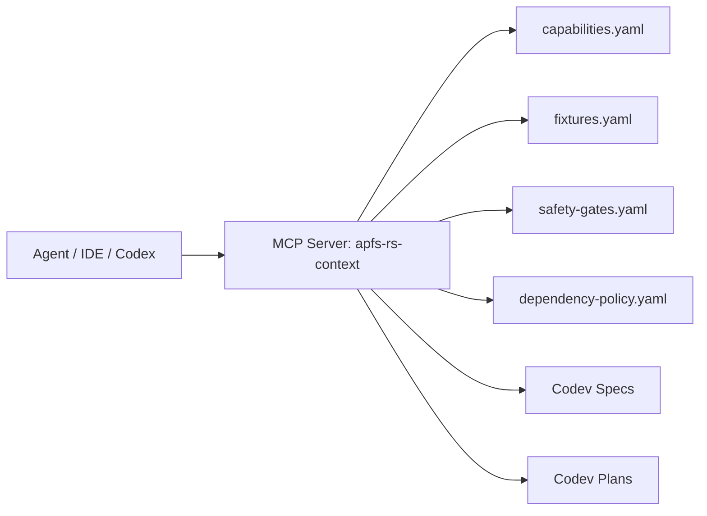

# APFS-RS MCP Agent Interface

Document version: 0.2.0  
Status: Draft future interface  
Date: 2026-06-23

## Purpose

A future read-only MCP server can make APFS-RS project context available to coding agents without requiring them to parse every markdown file manually. The first MCP interface is for development context only, not for mounting or writing disks.

## Security posture

The MCP server is read-only by default.

It must not expose:

- Raw-device write tools.
- Physical-disk write tools.
- Secret/key extraction tools.
- Password recovery or cracking tools.
- Fixture deletion tools.
- Privileged mount operations.
- Unredacted diagnostic exports.

## Candidate resources

| Resource | Purpose |
|---|---|
| `apfs://capabilities` | Machine-readable capability registry. |
| `apfs://fixtures` | Fixture registry and coverage. |
| `apfs://safety-gates` | Safety gate registry. |
| `apfs://dependency-policy` | Dependency governance. |
| `apfs://specs/{id}` | Spec lookup. |
| `apfs://plans/{id}` | Plan lookup. |
| `apfs://reviews/{id}` | Review lookup. |

## Candidate tools

| Tool | Input | Output | Side effects |
|---|---|---|---|
| `apfs.capability.get` | capability ID | capability metadata | None |
| `apfs.capability.search` | query/track/milestone | matching capabilities | None |
| `apfs.fixture.list` | filters | fixture rows | None |
| `apfs.fixture.get_manifest` | fixture ID | manifest metadata | None |
| `apfs.safety.check_change` | changed paths, declared capability | required gates/reviews | None |
| `apfs.ci.required_checks` | changed paths/capabilities | required CI jobs | None |
| `apfs.dependency.review_status` | dependency name | policy/review status | None |
| `apfs.task.packet` | issue metadata | task packet draft | None |

## Tool example

Request:

```json
{
  "capability_id": "M-009"
}
```

Response:

```json
{
  "capability_id": "M-009",
  "name": "Regular file read and extraction",
  "milestone": "windows_readonly_mvp",
  "required_tests": [
    "fixture_hash_match",
    "streaming_large_file",
    "extraction_path_safety"
  ],
  "safety_gates": [
    "read_only_default",
    "path_traversal_protection",
    "bounded_memory"
  ]
}
```

## Implementation architecture



## Future extension

After the implementation repository is mature, a separate local-only development MCP server may expose safe commands such as:

- `apfs.dev.run_check`.
- `apfs.dev.fixture_validate`.
- `apfs.dev.fuzz_smoke`.

These must run in the current workspace only and must not access raw block devices.

## Acceptance criteria

- MCP interface remains read-only for context until a dedicated spec accepts safe command execution.
- Tool schemas are deterministic and versioned.
- Responses include source paths and document versions.
- No tool exposes secrets, raw disk mutation, or privileged mount operations.
