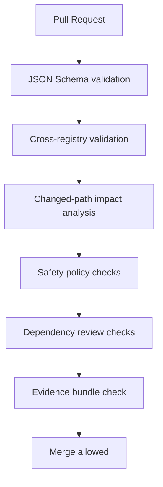

# APFS-RS Schema Validation and Policy-as-Code

Document version: 0.3.0  
Status: Draft  
Date: 2026-06-23

## Purpose

The 0.2.0 context pack added machine-readable registries. This 0.3.0 plan makes them enforceable. The implementation repository should fail CI when capability, fixture, safety, or dependency policy data becomes inconsistent with code changes.

## Policy goals

1. Detect malformed registries before merge.
2. Detect capability-changing PRs that fail to update capability metadata.
3. Detect fixture rows that do not map to real capabilities.
4. Detect safety gates that are referenced but undefined.
5. Detect new dependencies without review metadata.
6. Detect unsafe code without review blocks.
7. Detect write-adjacent changes before write-lab approval.
8. Generate a release evidence bundle from the same metadata.

## Files to validate

```text
codev/resources/apfs-rs/capabilities.yaml
codev/resources/apfs-rs/fixtures.yaml
codev/resources/apfs-rs/safety-gates.yaml
codev/resources/apfs-rs/dependency-policy.yaml
codev/resources/apfs-rs/schemas/*.schema.json
codev/specs/apfs-rs/0003-capabilities-matrix.md
```

## Validation layers



## Schema validation

Minimum schemas:

- `capabilities.schema.json`
- `fixtures.schema.json`
- `safety-gates.schema.json`
- `dependency-policy.schema.json`

Schema validation catches structural problems only. Cross-registry checks catch semantic problems.

## Cross-registry checks

Required checks:

| Check | Failure condition |
|---|---|
| Capability safety gates exist | A capability references a non-existent safety gate. |
| Capability fixtures exist | A release-blocking capability lacks a planned or implemented fixture. |
| Fixture capabilities exist | A fixture references a non-existent capability ID. |
| Dependency review fields exist | A dependency marked `requires_review` lacks required metadata. |
| Safety gate tests exist | A safety gate references a test name with no registered plan or fixture. |
| Capability matrix parity | Capability IDs in YAML and markdown matrix diverge without explicit waiver. |

## Changed-path policy

`xtask safety-check --changed-files changed.txt` should map changed paths to required gates.

Examples:

| Changed path | Required checks |
|---|---|
| `crates/apfs-core/**` | parser tests, fuzz smoke, capability update. |
| `crates/apfs-win/**` | Windows maintainer review, raw-device read-only gate. |
| `crates/apfs-write/**` | write-safety maintainer review, no physical write path check. |
| `crates/apfs-crypto/**` | security review, secret redaction tests. |
| `Cargo.toml` / `Cargo.lock` | dependency-policy review, cargo deny/audit/vet. |
| `.github/workflows/**` | least-privilege permissions check. |

## Unsafe-code detector

CI should fail if a diff adds `unsafe` without one of:

- `unsafe_review_block` in the PR body.
- A linked accepted ADR/spec.
- A required reviewer approval label.

This does not replace human review; it prevents accidental unsafe additions.

## Write-path detector

Before write beta, CI should fail if a diff introduces suspicious raw-write terms in device-facing crates:

```text
GENERIC_WRITE
FILE_WRITE_DATA
write_at_device
raw_write
exclusive_write
CreateFileW.*WRITE
```

False positives should require a maintainer waiver and a safety-review note.

## Release evidence bundle

`cargo xtask release-evidence` should produce:

```text
release-evidence/
├── compatibility-snapshot.json
├── capability-coverage.json
├── fixture-coverage.json
├── safety-refusal-summary.json
├── dependency-review-summary.json
├── ci-checks.json
├── sbom-path.txt
└── provenance-path.txt
```

## CI workflow integration

```yaml
- name: Validate APFS registries
  run: cargo xtask registry-check

- name: Check APFS safety policy
  run: cargo xtask safety-check --changed-files changed-files.txt

- name: Check capability coverage
  run: cargo xtask capability-check --changed-files changed-files.txt
```

## Agent benefit

Policy-as-code gives agents immediate feedback. Instead of reading every document, agents can run:

```bash
cargo xtask task-context M-009
cargo xtask safety-check --changed-files changed.txt
cargo xtask fixture-check simple-unencrypted-case-sensitive-001
```

This turns the Codev pack into an executable project operating system.
