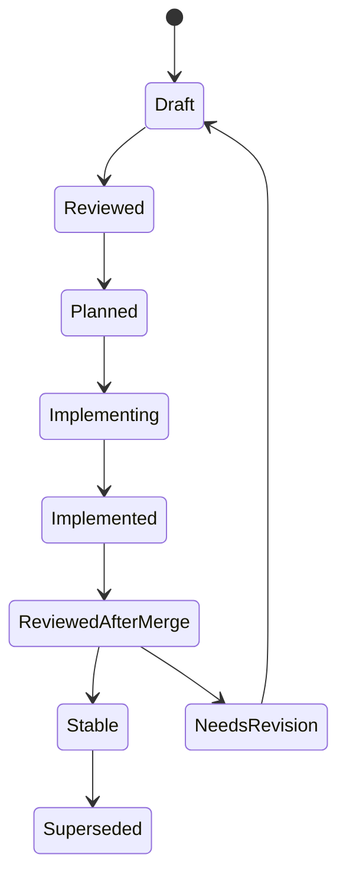

# APFS-RS Versioning and Governance

Document version: 0.2.0  
Status: Draft  
Date: 2026-06-23  
Codev phase: Resource

## Purpose

This file defines how the APFS-RS planning context, implementation crates, compatibility claims, machine-readable registries, fixtures, evidence bundles, and releases should be versioned and governed.

## Versioning layers

APFS-RS has multiple versioned layers:

| Layer | Version style | Example | Notes |
|---|---|---|---|
| Planning context | SemVer-like document version | `0.2.0` | Versioned through Codev docs and changelog. |
| Machine-readable registries | Schema version | `schema_version: 0.2.0` | Applies to capabilities, fixtures, safety gates, and dependency policy. |
| Rust crates | SemVer | `apfs-core 0.1.0` | Public API compatibility managed per crate. |
| CLI | SemVer + JSON schema version | `apfs-cli 0.1.0`, schema `0.1.0` | CLI output stability requires explicit policy. |
| Compatibility matrix | Date + release version | `2026-06-23 / 0.2.0` | Snapshot included in every release. |
| Fixture corpus | Manifest version | `fixtures-v0.2.0` | Tracks generation scripts, expected hashes, and feature coverage. |
| Write lab evidence | Evidence bundle version | `write-lab-evidence-v0.1.0` | Required before write beta. |
| Agent templates | Template version | `0.2.0` | Root/path-specific implementation-repo instructions. |
| Release artifacts | Release tag | `v0.6.0` | Signed/provenance artifacts for public binaries. |

## Current planning-context version

The current APFS-RS Codev context pack is `0.2.0`.

Version `0.2.0` adds the agentability and hardening layer:

- Agent instruction templates.
- Machine-readable registries.
- Fixture/differential-testing spec.
- CLI/UX spec.
- Agent operating model.
- Safety refusal matrix.
- Unsafe-code policy.
- Windows test lab.
- Release engineering.
- GitHub rulesets.
- Future read-only MCP interface.
- High-assurance Rust quality plan.
- Initial ADRs.

## Document versioning

Document version format:

```text
MAJOR.MINOR.PATCH
```

- **PATCH** — typo, link, or clarification that does not change requirements.
- **MINOR** — new requirement, capability, plan, gate, registry, dependency strategy, or automation policy.
- **MAJOR** — change to safety posture, licence posture, MVP definition, or write-support rules.

Every material document change must update:

1. The document header.
2. `CHANGELOG.md`.
3. Any affected index links.
4. Any affected capability matrix or machine-readable registry entry.

## Registry versioning

Machine-readable registries must include `schema_version` and `updated`.

Registries:

- `capabilities.yaml`.
- `fixtures.yaml`.
- `safety-gates.yaml`.
- `dependency-policy.yaml`.

Registry changes require:

- Changelog note for material changes.
- Spec/resource update if semantics change.
- CI schema validation once implementation begins.
- Review by the responsible owner when safety, dependency, fixture, or capability scope changes.

## Crate SemVer policy

Before `1.0.0`, APIs may change, but releases must still document breaking changes.

After `1.0.0`:

- Breaking public API changes require a major version bump.
- CLI JSON schema breaking changes require a documented migration path.
- On-disk APFS compatibility claims require fixture evidence.
- Security-sensitive changes require review notes.

Use `cargo-semver-checks` before publishing crates with public APIs.

## Release channels

| Channel | Intended users | Stability | Write support |
|---|---|---|---|
| `dev` | Contributors | Unstable | Lab-only, fixtures/images only. |
| `alpha` | Testers | Unstable | Read-only unless explicit lab binary. |
| `beta` | Advanced users | Feature-specific | Restricted only after evidence gates. |
| `stable` | General users | Supported | Only capabilities that passed safety gates. |
| `lab` | Maintainers/testers | Isolated | Disposable images only. |

## Release naming

Recommended implementation release sequence:

| Release | Target |
|---|---|
| `0.1.0-alpha.1` | CLI can inspect simple APFS images. |
| `0.2.0-alpha.1` | CLI can list volumes and directories. |
| `0.3.0-alpha.1` | CLI can extract regular files from simple images. |
| `0.4.0-beta.1` | Windows read-only image mount. |
| `0.5.0-beta.1` | Windows read-only external-device mount. |
| `0.6.0` | First Windows read-only public release. |
| `0.7.0` | Advanced read features. |
| `0.8.0` | Software-encryption read support for documented software paths. |
| `0.9.0-lab.1` | Image-only write lab. |
| `0.10.0-beta.1` | Restricted Windows write beta, if gates pass. |

## Compatibility claim policy

The project must never say simply “supports APFS” without qualifiers.

Every release must publish:

- Supported APFS feature combinations.
- Tested operating systems.
- Tested source types: image, external disk, raw device, DMG.
- Unsupported cases.
- Experimental cases.
- Known limitations.
- Fixture evidence summary.
- Safety refusal summary.

Compatibility labels:

| Label | Meaning |
|---|---|
| Supported | CI/fixture/differential evidence exists and maintainers intend to support it. |
| Experimental | Works in some tests, but not enough evidence for support. |
| Diagnostic only | Metadata can be detected, but read/write behaviour is not implemented. |
| Unsupported | The tool refuses or does not implement this capability. |
| Excluded | Deliberately out of scope under current policy. |

## Governance roles

| Role | Responsibilities |
|---|---|
| Architect | Maintains specs, roadmap, and Codev context. |
| Core maintainer | Owns APFS core correctness and parser design. |
| Windows maintainer | Owns WinFsp/Dokany adapters and Windows packaging. |
| Security maintainer | Owns crypto, redaction, supply-chain, fuzzing, unsafe-code review, and security reports. |
| Write-safety maintainer | Owns transaction model and write-lab evidence. |
| Test infrastructure maintainer | Owns fixtures, manifests, differential testing, and CI. |
| Release manager | Owns release gates, changelog, signing, SBOM, provenance, and compatibility matrix snapshots. |
| Agentability maintainer | Owns agent templates, task-packet workflow, machine-readable registry checks, and MCP context interface. |

For a small project, one person may hold multiple roles, but the role should still be explicit in PR review.

## Decision records

Use ADRs for architectural decisions:

```text
codev/resources/apfs-rs/adrs/ADR-0001-parser-strategy.md
codev/resources/apfs-rs/adrs/ADR-0002-winfsp-binding-strategy.md
codev/resources/apfs-rs/adrs/ADR-0003-agent-instructions-strategy.md
codev/resources/apfs-rs/adrs/ADR-0004-fixture-distribution-strategy.md
```

ADR states:

- Proposed.
- Accepted.
- Superseded.
- Rejected.

ADR template:

```markdown
# ADR-NNNN: Title

Status: Proposed
Date: YYYY-MM-DD

## Context

## Decision

## Consequences

## Alternatives considered

## Review date
```

## Spec lifecycle



## Pull request governance

Every PR must answer:

- Which issue does this close?
- Which spec does this implement?
- Which plan does this follow?
- Which capabilities are changed?
- Which fixtures were added or updated?
- Which safety gates are affected?
- Which CI gates are relevant?
- Is any unsafe code added?
- Is any dependency added?
- Does the compatibility matrix change?
- Does a machine-readable registry change?
- Does the safety posture change?

## Agent governance

Agent-ready tasks must include a task packet with:

- Capability ID.
- Read-first context links.
- Files likely to change.
- Files/areas not to change.
- Required commands.
- Acceptance evidence.
- Review update target.

Agents may work on docs, tests, fixtures, read-only parsing, and read-only adapters when scoped. Agents must not independently widen a task to unsafe, crypto, or write functionality.

## Write-support governance

Write support has special rules:

1. Write code begins in image-only lab mode.
2. Lab mode must be a separate feature gate or binary.
3. Physical-device write mode requires a specific spec and governance approval.
4. Unknown incompatible APFS features block writes.
5. Damaged metadata blocks writes unless a repair spec explicitly covers the case.
6. Write releases require crash-injection evidence.
7. Write releases require compatibility matrix and safety-refusal updates.
8. Write beta requires clear user warnings and backup guidance.

## Security disclosure governance

The implementation repository should add `SECURITY.md` before public code release.

Minimum policy:

- Provide private reporting channel.
- Define supported versions.
- Define response expectations.
- Treat data-loss bugs as security-sensitive when they can be triggered by untrusted images.
- Treat parser panics and resource exhaustion on untrusted images as security-sensitive.
- Treat accidental secret exposure as security-sensitive.

## Fixture governance

Fixture rules:

- Synthetic data only.
- No personal data.
- Generation script committed where possible.
- Manifest committed with hashes and metadata.
- Large images stored outside Git or generated in CI.
- Each fixture maps to capabilities.
- Fixture provenance recorded.
- Encrypted fixture secrets must not be committed.

## Changelog policy

`CHANGELOG.md` should use sections:

- Added.
- Changed.
- Deprecated.
- Removed.
- Fixed.
- Security.
- Compatibility.
- Automation.
- Documentation.

Planning context changes and implementation releases can share the same changelog initially, but should split if the implementation repository becomes large.
