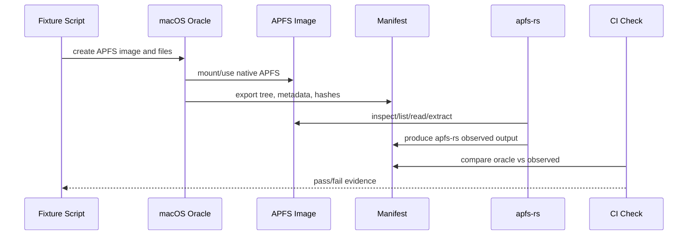

# Spec 0004: Fixture and Differential Testing

Document version: 0.2.0  
Status: Draft  
Date: 2026-06-23  
Codev phase: Specify

## Purpose

APFS-RS must make evidence-backed compatibility claims. This spec defines fixture generation, manifests, differential testing, and release evidence requirements for read, encryption-read, and write-lab milestones.

## Principles

1. Synthetic data only.
2. Reproducible fixture generation scripts.
3. No personal data.
4. No secret material in committed artifacts.
5. Large fixture images are generated locally or in controlled CI, not committed by default.
6. Every supported capability maps to at least one fixture.
7. Every release includes a compatibility matrix snapshot backed by fixture evidence.
8. macOS native tools are used as the behavioural oracle where lawful and practical.

## Fixture types

| Type | Purpose | Commit policy |
|---|---|---|
| Minimal disk image | Basic APFS parser and extraction tests | Manifest first; image optional if small and legally safe. |
| Mutated corrupt image | Safe refusal tests | Prefer mutation script plus manifest. |
| Advanced read image | xattrs, compression, snapshots, sparse files | Manifest and generation script; image size reviewed. |
| Encrypted image | Software-encryption read tests | Manifest only; no secrets in Git. |
| Disposable write-lab image | Transaction/crash testing | Generated in CI or locally; never committed. |

## Required fixture manifest fields

```yaml
fixture_id: simple-unencrypted-case-sensitive-001
schema_version: 0.2.0
created_with:
  os: macOS
  os_version: TBD
  commands_script: tools/macos-fixtures/simple-unencrypted-case-sensitive.sh
source_type: apfs_disk_image
apfs_features:
  encrypted: false
  compressed: false
  snapshots: false
  case_sensitive: true
  volume_group: false
  fusion: false
capability_ids:
  - M-001
  - M-008
expected_artifacts:
  tree_manifest: manifest.json
  file_hashes: hashes.sha256
  metadata_manifest: metadata.json
hash_algorithm: sha256
safe_to_commit: manifest_only_initially
redaction:
  contains_personal_data: false
  contains_secret_material: false
```

## Differential testing workflow



## Read-only acceptance evidence

A read capability is complete only when:

1. A fixture row exists in `fixtures.yaml`.
2. The fixture maps to a capability ID in `capabilities.yaml`.
3. A generation script or manual provenance note exists.
4. macOS oracle output exists where applicable.
5. APFS-RS output matches expected tree and file hashes.
6. Unsupported/corrupt variants fail with typed errors.
7. CI runs the relevant fixture check or documents why it is manual/self-hosted.

## Compression evidence

Compression support requires APFS-specific fixtures, not only generic compressor round trips.

Required cases:

- ZLIB compressed file.
- LZVN compressed file.
- LZFSE compressed file.
- Unknown compression method refusal.
- Oversized or decompression-bomb-style refusal.

## Snapshot evidence

Snapshot support requires:

- Snapshot list from macOS oracle.
- Snapshot-specific tree manifest.
- Hash verification from selected snapshot.
- Proof that live view and snapshot view are separated.
- Read-only mount/extract mode only.

## Software-encryption evidence

Software-encryption read support requires:

- Synthetic encrypted fixture.
- Test secret stored outside committed repository or generated on demand.
- Invalid secret refusal test.
- Redaction test proving secrets do not appear in logs, diagnostics, or artifacts.
- Security review before release.

## Write-lab evidence

Image-only write support requires:

1. Disposable image generation.
2. Transaction plan for each operation.
3. Failure injection after every write step.
4. Remount and verify with APFS-RS.
5. Remount and verify with macOS where possible.
6. Random operation sequence testing.
7. Evidence bundle versioned and attached to release notes.

## CI tiers

| Tier | Trigger | Scope |
|---|---|---|
| PR smoke | pull request | Minimal image fixtures, parser fuzz-smoke, JSON schema checks. |
| Platform smoke | pull request/merge queue | Windows/Linux/macOS build and selected image tests. |
| Nightly | schedule | Larger fixture matrix, longer fuzz, mutation testing. |
| Manual protected | maintainer trigger | macOS fixture generation, WinFsp mount lab, write-lab evidence. |
| Pre-release | tag/release branch | Full supported matrix and compatibility snapshot. |

## Fixture governance

- Fixture updates must be reviewed by the test infrastructure maintainer.
- Any committed image must be synthetic, minimal, and licence/provenance reviewed.
- Encrypted fixtures must not commit real secrets.
- Diagnostic exports must be redacted.
- Each fixture must list the APFS features it exercises.

## Agent requirements

Coding agents must not invent fixture results. If a fixture does not exist, the agent should add or update a fixture plan and implement only the capability code that can be tested safely.

## Non-goals

- Publishing large real-world APFS images.
- Using personal user disks as fixtures.
- Treating any single macOS version as complete APFS coverage.
- Using fixture success to imply universal APFS support.
