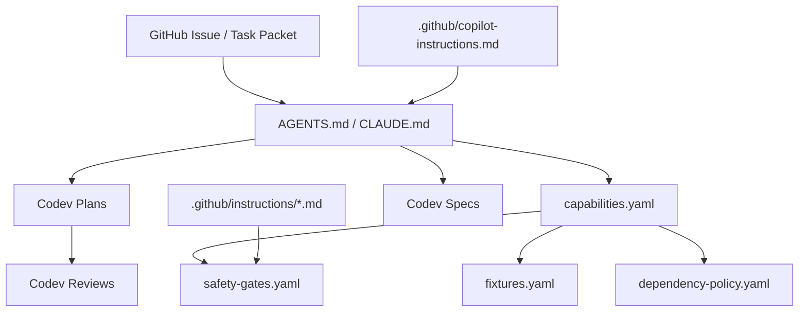

# Spec 0006: Agent Operating Model

Document version: 0.2.0  
Status: Draft  
Date: 2026-06-23  
Codev phase: Specify

## Purpose

APFS-RS should be easy and safe for coding agents to work on. This spec defines the agent context model, task packet format, safety boundaries, review expectations, and future MCP/skill integration.

## Agent goals

1. Make tasks self-contained and narrow.
2. Make safety rules explicit and machine-readable.
3. Make required tests discoverable.
4. Prevent accidental raw-device, write, crypto, or unsafe-code changes.
5. Preserve Codev traceability from issue to review.
6. Enable multiple coding agents without context drift.

## Context hierarchy



## Agent task packet

Every agent-suitable issue should include:

```markdown
# Agent Task Packet

## Capability

Capability ID:

## Goal

One-sentence outcome.

## Read first

- Spec:
- Plan:
- Design/resource:
- Capability registry row:
- Safety gates:
- Fixture registry rows:

## Files likely to change

- crates/...
- tests/...
- fixtures/...
- codev/...

## Must not change

- raw-device write code
- crypto dependencies
- unsafe code
- physical write behaviour

## Required commands

- just agent-check
- just fixture-check <fixture-id>
- just fuzz-smoke <target>

## Acceptance evidence

- tests:
- fixture output:
- docs updated:
- review note:
```

## Agent task classes

| Class | Suitable for agents | Human approval required first |
|---|---:|---:|
| Docs update | Yes | No, unless safety posture changes. |
| Parser unit tests | Yes | No, unless unsafe code added. |
| Read-only parser feature | Yes | Plan review recommended. |
| Windows read-only adapter | Yes | Plan review recommended; FFI review required. |
| Fixture manifest generation | Yes | Test-infra review required. |
| Dependency addition | Limited | Yes. |
| Unsafe code | Limited | Yes. |
| Crypto/key handling | Limited | Yes. |
| Image-only write lab | Limited | Yes. |
| Physical-device write | No | Accepted beta spec and governance approval required. |

## Agent guardrails

Agents must not:

- Widen scope from read-only to write.
- Add dependencies opportunistically.
- Replace explicit parsing with unchecked transmute-style shortcuts.
- Invent fixture results.
- Disable tests or warnings to pass CI.
- Create hidden fallback paths for corrupt APFS structures.
- Implement unsupported encryption or access-control bypass.

## Required review note

After implementation, the agent or maintainer should add/update a review entry:

```markdown
# Review: <capability ID> <title>

## What changed

## Tests and evidence

## Safety gates checked

## Lessons learned

## Follow-up issues
```

## Future MCP interface

A read-only MCP server may expose APFS-RS project context to coding agents:

- `apfs.capability.get`
- `apfs.capability.search`
- `apfs.fixture.list`
- `apfs.fixture.get_manifest`
- `apfs.safety.check_change`
- `apfs.ci.required_checks`
- `apfs.dependency.review_status`

It must not expose raw disk write, secret extraction, fixture deletion, or privileged mount tools.

## Future agent skills

Reusable skills should be task-specific and narrow:

- APFS parser change.
- Fixture addition.
- Windows mount adapter change.
- Dependency review.
- Write-safety review.
- Release readiness review.

## Acceptance criteria

- Agent templates exist for implementation repo.
- Machine-readable registries exist for capabilities, fixtures, safety gates, and dependencies.
- Issue and PR templates reference task packets and safety gates.
- CI plan includes matrix/capability checks.
- Review process captures lessons back into Codev context.
